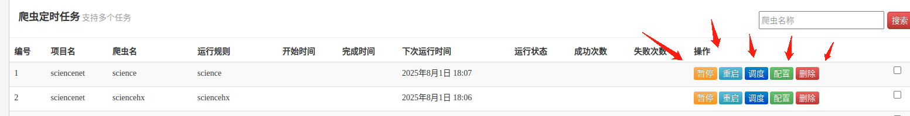
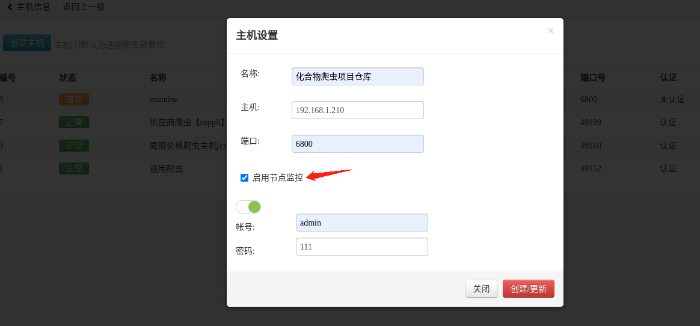
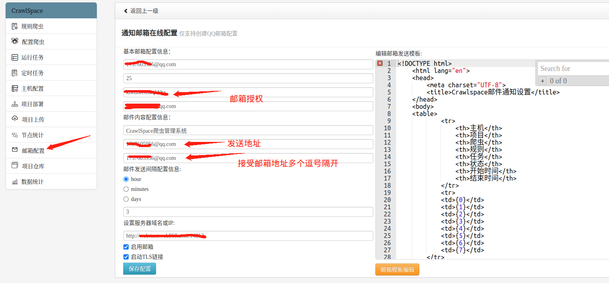
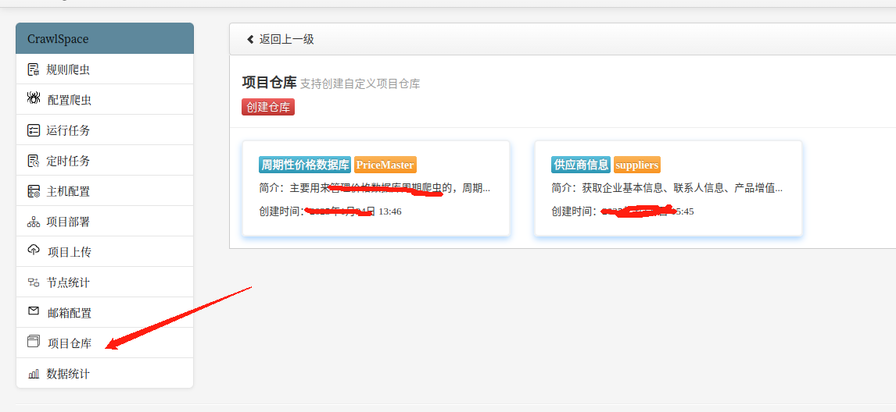

## CrawlSpace爬虫部署框架介绍

CrawlSpace全新的爬虫部署框架，为了适应工作的爬虫部署的使用，需要自己开发一个在线编写爬虫及部署爬虫的框架，框架采用的是Django2.2+bootstap依赖scrapyd开发的全新通用爬虫在线编辑部署及scrapy项目的部署框架。项目实现的五大块的功能及许多在维护爬虫的过程中用的许多实用的操作功能。

首页通用爬虫的模块编写采集全站的数据：


爬虫项目的运行列表

日志结果查看

定时任务列表

任务配置查看

主机信息列表

主机创建

项目打包及部署

项目调度

定时任务设置

scrapy项目在线编辑

节点可视化监控，支持在线检测主机状态并提示功能


邮箱通知功能

项目仓库地址


通用爬虫月度数据源可视化统计（自定义数据）


以上就是crawlspace的功能，相比其他的部署，这个部署框架更加的便于维护爬虫项目，操作更加灵活方便，交互更加便捷舒适，功能更加完善，信息的显示更加清晰，同时支持手机端在线操作！


## Docker项目部署

```
项目根目录下创建镜像crawlspace：
docker build -t crawlspace .
创建容器：
mkdir -p /crawlspace/spider/configs
mkdir -p /crawlspace/spider/project
docker run -d -p 8000:8000 --name crawlspace --restart=always -v /crawlspace/spider/configs:/CrawlSpace/spider/configs -v /crawlspace/spider/project:/CrawlSpace/spider/project crawlspace:latest

```
## 运行
```commandline
python .\manage.py runserver 0.0.0.0:8000
```

## 本地运行
```
./crawlspacex.sh start
```
## 本地停止
```
./crawlspacex.sh stop
```
